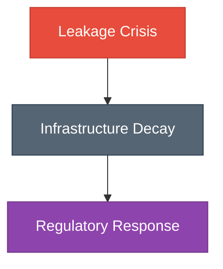
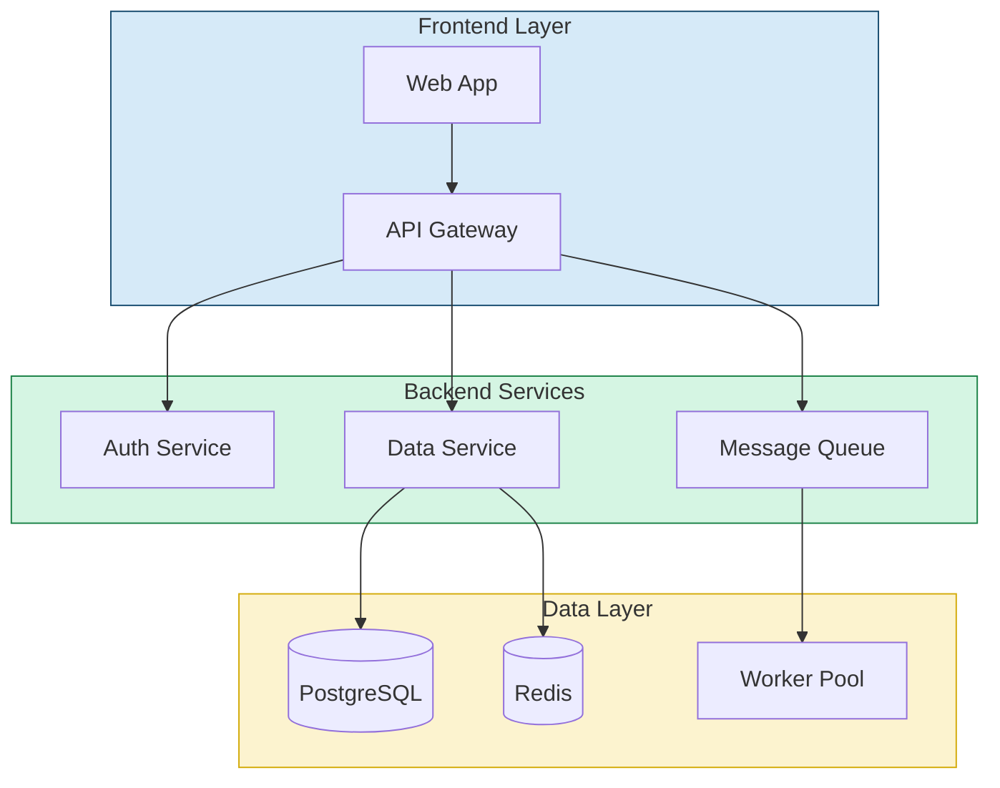
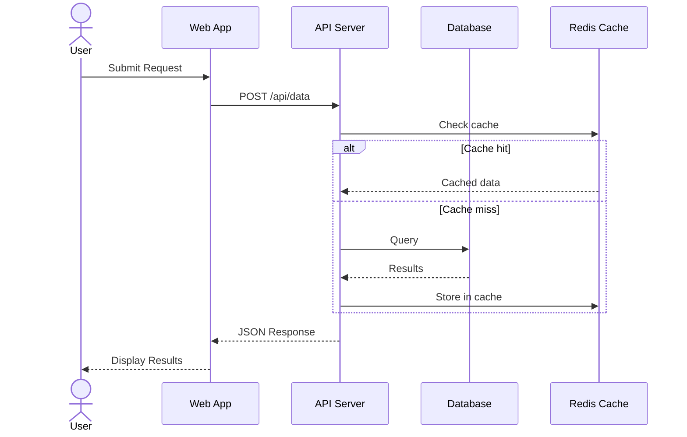
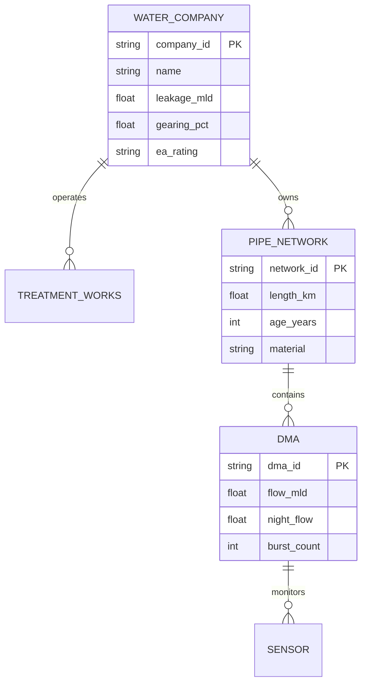
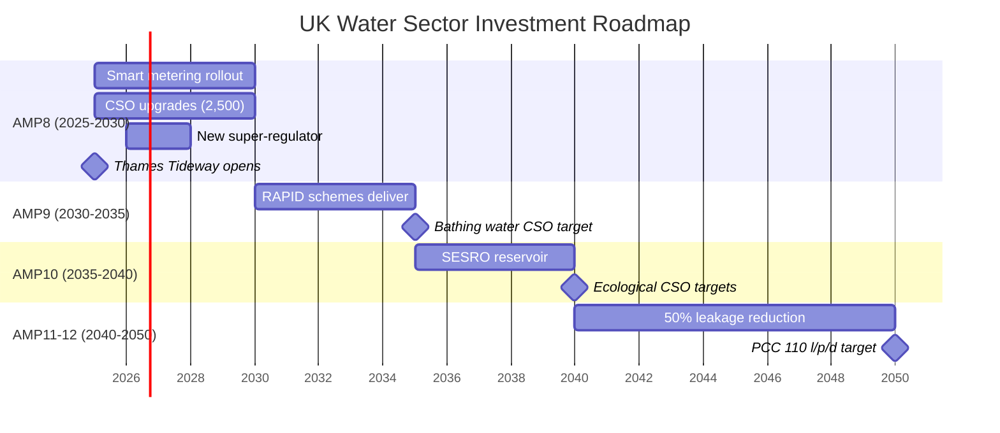
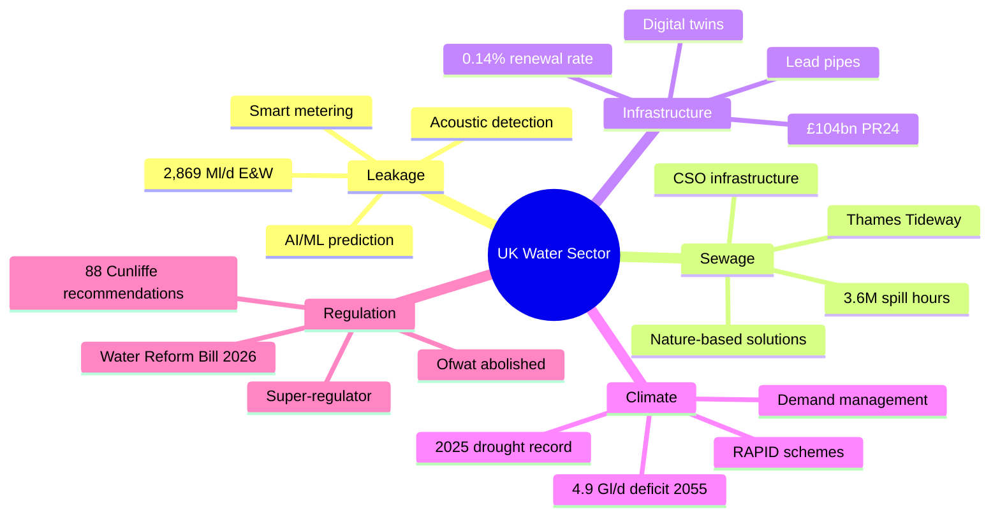
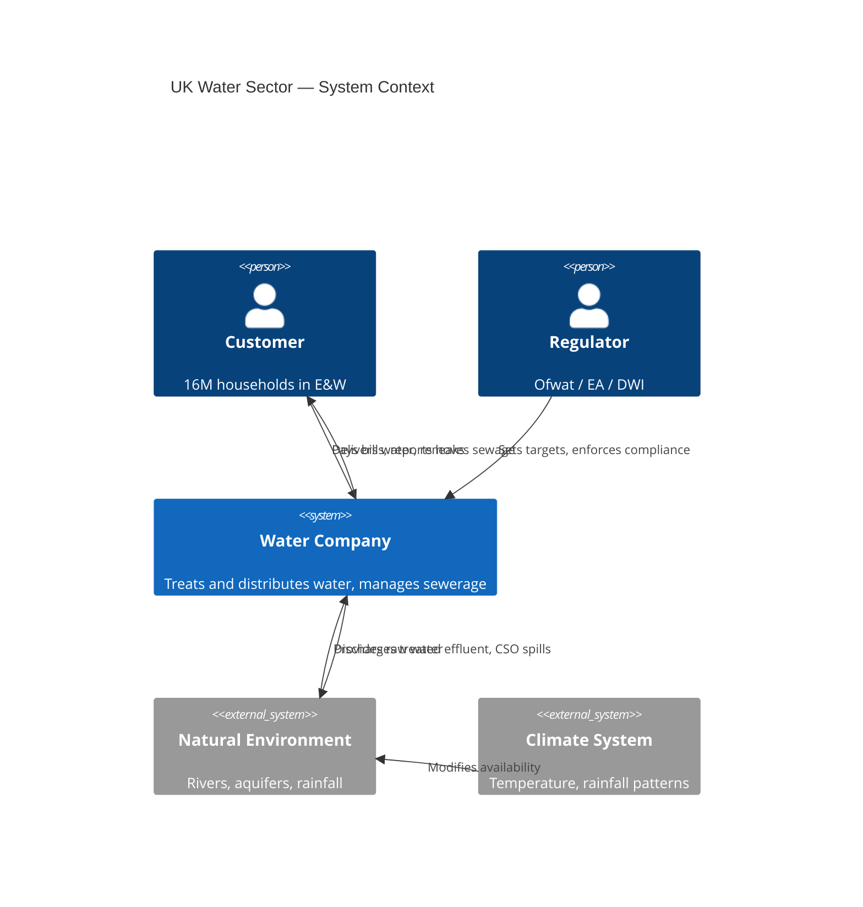

# Styling & Templates

## Professional Styling

### Dark Theme (report-builder compatible)

```bash
# Create dark theme config
cat > mermaid-dark.json << 'EOF'
{
  "theme": "dark",
  "themeVariables": {
    "primaryColor": "#2471A3",
    "primaryTextColor": "#FFFFFF",
    "primaryBorderColor": "#5DADE2",
    "lineColor": "#ABB2B9",
    "secondaryColor": "#1B4F72",
    "tertiaryColor": "#0B2545",
    "background": "#0B2545",
    "mainBkg": "#13315C",
    "nodeBorder": "#5DADE2",
    "clusterBkg": "#1B4F72",
    "clusterBorder": "#2471A3",
    "titleColor": "#FFFFFF",
    "edgeLabelBackground": "#13315C",
    "fontSize": "14px"
  }
}
EOF

# Render with dark theme
mmdc-sidecar.sh -i diagram.mmd -o diagram.png -t dark
```

### Light Theme (academic papers)

```bash
cat > mermaid-light.json << 'EOF'
{
  "theme": "default",
  "themeVariables": {
    "primaryColor": "#D6EAF8",
    "primaryTextColor": "#0B2545",
    "primaryBorderColor": "#1B4F72",
    "lineColor": "#566573",
    "secondaryColor": "#FADBD8",
    "tertiaryColor": "#D5F5E3",
    "fontSize": "13px",
    "fontFamily": "serif"
  }
}
EOF

mmdc-sidecar.sh -i diagram.mmd -o diagram.png
```

Ready-made theme configs also live in `resources/templates/theme-dark.json` and
`resources/templates/theme-light.json`.

### Per-node styling (inline)



---

## Templates by Use Case

### System Architecture



### API Sequence



### Database ER Diagram



### Project Gantt



### Wardley-style Mindmap



### C4 Context Diagram



---

## Best Practices

1. **Use meaningful IDs**: `userAuth` not `A`, `paymentGateway` not `B`
2. **Keep it simple**: Under 30-40 nodes per diagram; split complex ones
3. **Consistent direction**: `TD` for hierarchies, `LR` for processes, `BT` for bottom-up
4. **Colour with purpose**: Use `classDef` for semantic meaning (red=error, green=success)
5. **Version control**: `.mmd` files are plain text — diff-friendly in git
6. **Theme consistency**: Use the same config across all diagrams in a project
7. **Label edges**: Always label arrows to show relationships: `A -->|"sends data"| B`
8. **Subgraphs for grouping**: Use subgraphs to create logical sections
</content>
